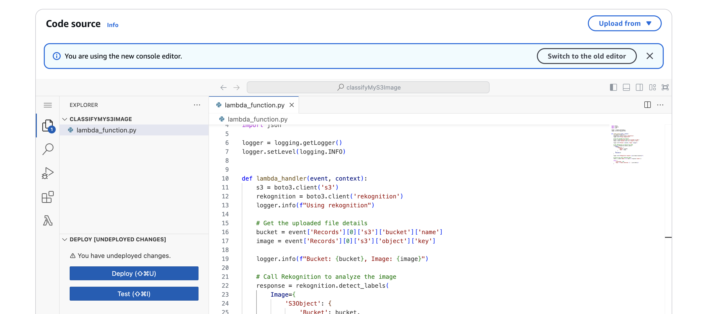
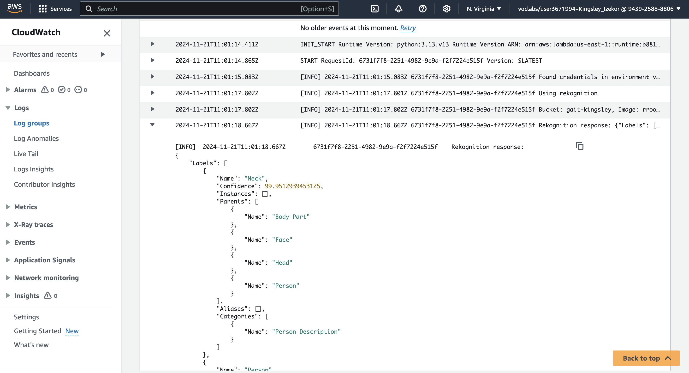

# Amazon Cloud (AWS) Overview

The lecture taught me that Amazon Web Services (AWS) is a popular cloud platform that provides a wide range of services such as computing power, storage, databases, and machine learning. AWS offers the resources and technology needed to develop, manage, and expand applications in a cloud environment. It is extremely versatile, safe, and budget-friendly, making it a great option for hosting websites, AI models, and other applications. Businesses in various sizes and industries utilize AWS to implement and oversee their digital solutions.

Before the lecture began, the teacher sent us an invitation link via email to join a class on AWS Academy. The class, titled AWS Academy Learner Lab, was designed to support our learning.

We created an AWS Account and choose a service which was AI Models, using Amazon SageMaker, and follow the teacher as she host our first data. 

### Steps to Set Up

- Log in to the AWS Management Console and navigate to the S3 service.
- Create a new S3 bucket by providing a unique name like mine "gait-Kingsley
- Configure the bucket settings as needed and finalize its creation.

### Upload a Photo
- I downloaded a photo from google and uploaded it
- I gave the bucket permissions to allow Lambda access for event notifications

### Set Up AWS Lambda Function

- I navigated to the AWS Lambda service and create a new function.
- My appropriate runtime was Python. 
-I added S3 trigger to the Lambda function. To specify my S3 bucket and event type, such as "Object Created."

### Write the Lambda Function Code

- I copied the code the teacher provided on canvas 
- I used the code editor to write a script that processes my uploaded photo.

### Enable CloudWatch Logs

- AWS Lambda automatically sends logs to CloudWatch. 
- To view the logs: I navigated to the CloudWatch service in AWS Management Console.
- Went to Log Groups and find the log group for my Lambda function as show below

{width=1436 height=779}

### Verify the Logs

- Lastly I verified the logs by selecting the log group and clicking on the latest log stream.
- As seen above the timestamp and log messages, such as when the photo was uploaded and processed.