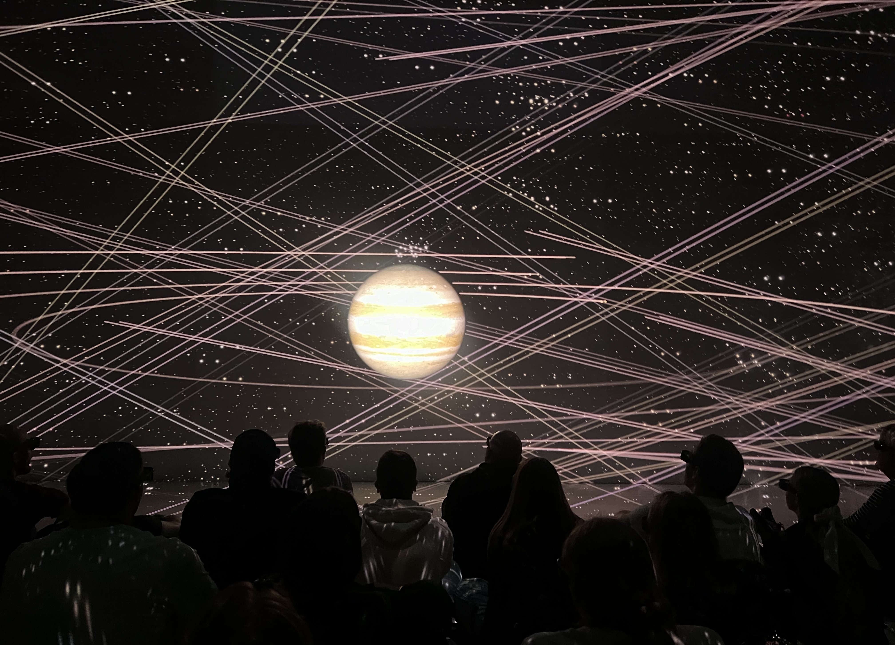

**On the 23rd of October**, we have a trip planned to the Ars Electronica Center in Linz. The Ars Electronica Center in Linz, Austria, is a museum and innovation center dedicated to art, technology, and society. From a quick research I did on my phone before embarking on the journey, I understood that It offers interactive exhibits, workshops, and displays that explore topics like artificial intelligence, virtual reality, robotics, 3D printing, and digital media.

We met with our tour guide at the Hagenberg bus station and catch the bus at 10:27 AM. We gathererd at 10:20 AM to ensure we're all on time. We had a guided tour there until 1:30 PM. when we arrived at the Ars Electronica Center, we were introduced to a museum guide who led us through the exhibits. She explained that we would explore various sections of the museum, each section showcasing different aspects of modern technology, including artificial intelligence, robotics, digital media and, lastly, virtual reality.

She guided us downstairs, where the first exhibit she showed us was a frame on the wall containing three pictures as shown below. 

She explained that these were real individuals who had lost parts of their bodies in accidents. The girl on the left has a prosthetic hand designed to look and feel like a plan. She can move, touch, and use it just like a natural hand. The man in the center has a prosthetic leg constructed from metal and sensors, allowing it to function precisely like a natural leg. She mentioned that her only complaint was the appearance, she didn’t like that the foot looked like a natural foot on top of a high tech leg. And the boy on the right has a cyborg hand that works like a real hand, with the added feature of being able to charge phones.

Next, she introduced us to a lifting jacket, designed to be worn like a backpack, that helps with lifting heavy objects. It’s built specifically for those working in logistics and other physically demanding industries to assist with lifting over extended periods. She asked if anyone would like to try it out, and Alex volunteered, recalling his experience lifting people at the Catalonia Casteller Festival when we were in Spain. 

 

She also showed us a plastic like object made from animal blood, asking us to pass it around and guess its material, which none of us could do successfully. When I held it, I noticed it was very hard, and no one could easily tell it was made from blood. Next, she introduced a leather like material made from plants. You could catch a faint scent hinting at its origin, but it was difficult to tell it was plant based. This exercise demonstrated just how advanced science and technology have become.

 

### 3D Printing

After that, we visited the 3D section, where we observed a variety of 3D-printed items, ranging from complex sculptures to useful prototypes. She demonstrated and  highlighted the various uses of 3D printing, from medical replicas to architectural blueprints to avant garde artwork. After working with 3D printer 2 semester ago, now witnessing the impact of 3D printing on various industries is motivating due to its ability to drive creativity and innovation.

 

### Virtual Reality Of the Earth, Planets, and Galaxy

Te last placed we exploered inside the Ars Electronica Center was the Virtual Reality Studio, were we saw a breathtaking 3D virtual reality display of our solar system and the entire galaxy. We saw planets in vivid detail, with moons gracefully orbiting around them and the radiant sun anchoring everything at the center, surrounded by countless stars. On planet Earth, we saw how it is covered with 70% water and only 30% land, to show just how unique and fragile our blue planet is.

Moving on to Jupiter, we learnt there are 95 moons in Jupiter. Europa one of Jupiter’s moons is believed to have enough water to cover Earth. Beneath its thick, icy crust, Europa is thought to hold a vast subsurface ocean, which may contain twice as much water as all of Earth’s oceans combined. If this water were spread across Earth, it would cover the entire planet to a significant depth, making Europa a fascinating place in the search for extraterrestrial life and a powerful example of how water might exist beyond Earth. As they zoomed out, we saw the solar system shrink into a tiny point within the Milky Way galaxy, which itself is only one of billions of galaxies in the cosmos. This grand perspective made it clear just how small Earth truly is, not only in size but in cosmic scale. 

They saw other galaxies floating at incomprehensible distances, each a cluster of countless stars, planets, and possibly other worlds with life. After the event, the amazing visual experience filled all of us with a sense of wonder and humility. Because seeing and showing the vastness of the universe reminded us of our small yet remarkable place within it.

afterward, we had free time to explore Linz.