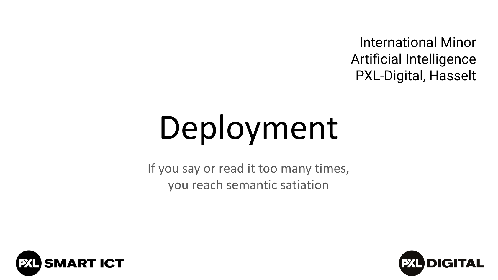
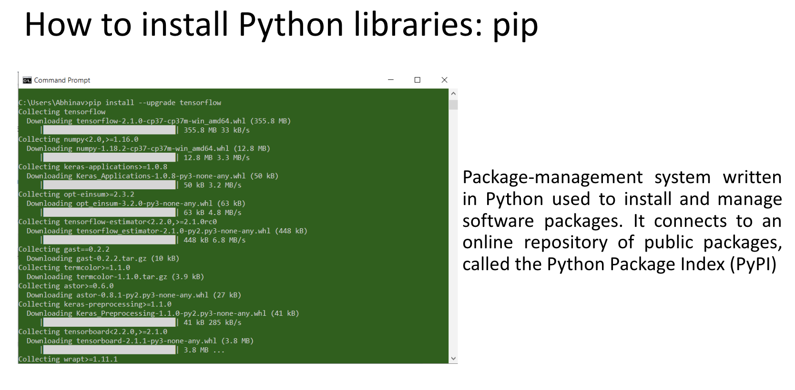
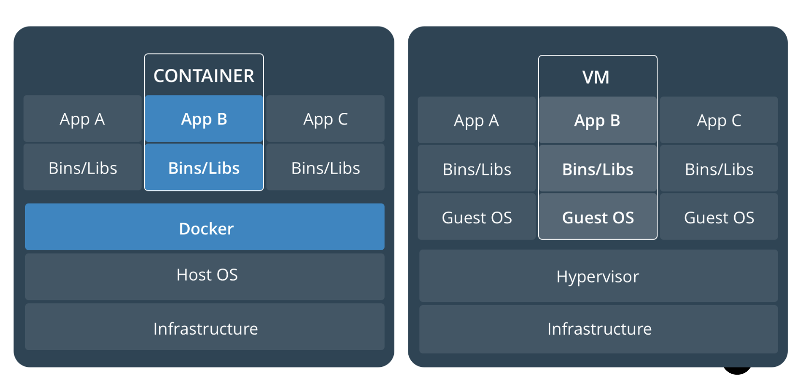
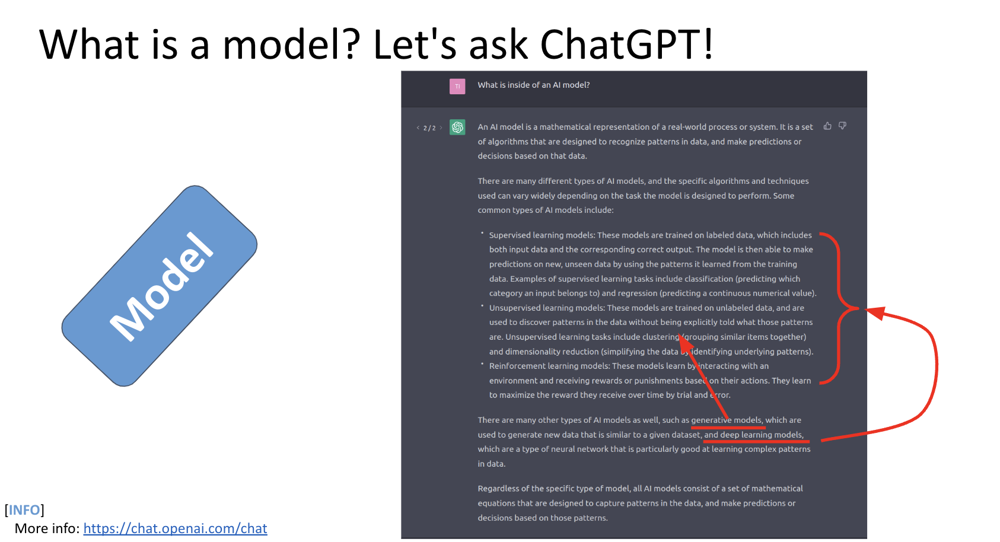
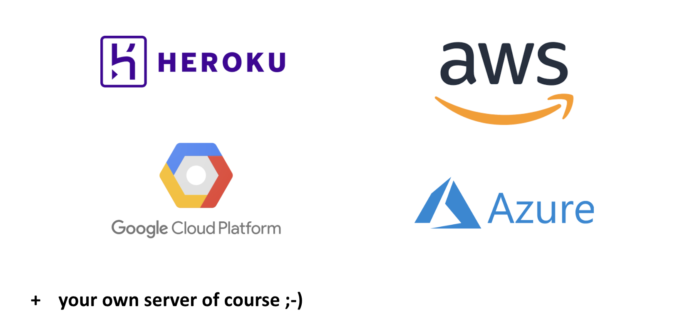

{width=844 height=476}

# BACKEND

After learning how to train our data in Large Language Model and Machine Learning. In this lecture, we were thought various tools used for deploying applications, such as Flask, FastAPI, and Django for Python-based development, as well as Node.js, Spring, and .NET. The teacher explained that they are for creating scalable and efficient server-side applications in various programming languages. 

### Flask 

I learnt that Flask is a lightweight WSGI web application framework designed for simplicity and flexibility. It is a language written in Python, it is ideal for building small to medium-sized applications quickly, as it does not require additional tools or libraries, making it minimalistic and easy to use. Unlike larger frameworks, It does not include built-in features such as database abstraction layers or form validation, allowing developers the freedom to choose their preferred tools. However, it supports extensions that can add functionality as needed. Known for its adaptability, It is used by major platforms like Pinterest and LinkedIn. The image also includes a basic example of a Flask application, demonstrating how to create a simple route and run it on a local server. 

### Flask API 

FastAPI is a modern Python web framework known for its speed, ease of use, and production-ready capabilities. It is one of the fastest Python frameworks available, comparable to Node.js in performance. It is designed to be user-friendly, minimising the time needed to learn and implement it, while also reducing code duplication with its concise structure. It allows developers to produce robust, production ready code efficiently. 

### Django 

Django is a high-level Python web framework designed for rapid development and pragmatic, clean design. It simplifies the creation of complex, database driven websites by offering built-in tools and features to streamline the process. It is recognised for being fast, helping developers take applications from concept to completion efficiently, secure, with robust measures to prevent common security issues, and scalable, making it suitable for handling high-traffic websites. It s widely used by major platforms like Instagram, Mozilla, and Bitbucket, Django is ideal for developers seeking a reliable and powerful framework for large-scale applications.

### .NET

I also learnt that .NET is a free and open source managed computer software framework written in C++ and C#. It supports cross-platform development for Windows, Linux, and macOS and serves as the successor to the .NET Framework. As of version 7 (released December 13, 2022), .NET facilitates rapid development for various scenarios, including ASP.NET Core web apps, command-line apps, libraries, and Universal Windows Platform apps. It supports applications in domains such as web development, mobile development, desktop apps, micro services, cloud services, machine learning, game development, and Internet of Things (IoT), making it versatile for a wide range of projects.

### Spring

The Spring Framework is a modern Java-based framework designed for enterprise applications, supporting deployment on any platform. It utilises a robust programming and configuration model to build applications efficiently. It also supports key features such as micro services for modular scalability, reactive programming for asynchronous operations, and cloud integration to connect and scale services across platforms. Additionally, it excels in creating secure, responsive web applications, enabling serverless architecture, processing event-driven workflows in real time, and automating batch tasks. 

### Node.Js

Lastly I learnt about Node.js as a deployment tool. Node.js is a runtime environment for JavaScript on the back-end, enabling developers to run JavaScript code away from web browsers. Operating on the V8 engine, it is compatible with multiple platforms and delivers impressive performance. Major companies such as GoDaddy, Groupon, IBM, Microsoft, Netflix, PayPal, and Amazon Web Services have extensively embraced Node.js. Its efficient management of asynchronous tasks makes it perfect for developing scalable and real-time apps. 

# FRONTEND

Some of the AI front-end frameworks for AI-driven applications given to us at the lecture are Plotly Dash, Streamlit, and Bokeh, which are Python-based tools for creating interactive visualisations, and Shiny, a framework in R, used for building dynamic web applications with data insights.

### python Dependency Handling

Since Python is the programming language we are using in this module. Python dependency management involves overseeing the external libraries or modules essential for a Python project's operation. Dependencies are usually software components that offer extra functionalities like data handling, webpage creation, or artificial intelligence capabilities. In order to manage dependencies effectively, Python employs resources such as pip (Python's package manager) and dependency files such as requirements.txt or pyproject.toml. These documents outline the necessary software and corresponding versions to maintain uniformity in various settings. The use of tools like venv, virtualenv, or Poetry can segregate dependencies for each project, preventing clashes between packages in separate projects. Effective management of dependencies guarantees that the project functions seamlessly and stays consistent for other developers or deployment.

{width=834 height=410}

### Container vs virtual machine (VM)

A container is a standard unit of software that packages up code and all its dependencies so the application runs quickly and reliably from one computing environment to another. 

{width=836 height=393}

Containers offer several advantages, including being self-contained, running instantly without booting, having minimal overhead, providing a standardized environment, offering partial host isolation, being cloud-ready, and enabling repeatable and reproducible solutions for fields like AI, robotics, and research.

### Model Deployment 

**What is a Model?**

An AI model is a program or algorithm that relies on a set of data to recognize patterns and make predictions or decisions.

**In other words:** 

- It’s the result of your model training
- You can use it to make classifications, predictions, etc. on new data 

{width=843 height=457}

# Hosting

On the last part of the lecturem, we were informed by the teacher that tools like Heroku, AWS, Google Cloud Platform, and Azure, provide excellent hosting solutions for deploying AI models. They offer scalable, reliable, and secure environments, making it easy for students to host and manage their AI models while focusing on building innovative applications. Whether you're experimenting with small models or deploying large scale AI systems, these tools are ideal for ensuring your models are accessible and efficiently operational.

{width=823 height=384}
