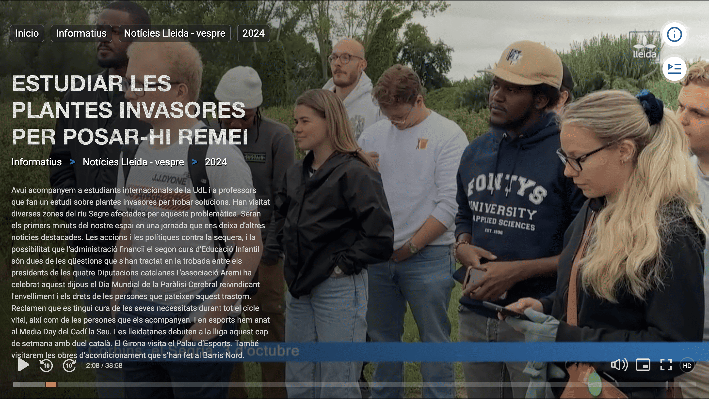

**OnOctober 4, 2024**, As part of our Minor program we had a field trip in Lleida Spain. The purpose of the trip was to educate us about the various types of invasive species disturbing the local ecosystem in Lleida. We left the school premises at 10am in the morning, and arrived at the first location which was an hour drive from the school. 

**Pueraria montana**

We were accompanied by two plant specialist, a botanist and a professor of agricultural plant management from a university in Lleida. When we got to our first location, we were introduced to an invasive plant that was disrupting a farm area in Lleida. The plant, Kudzu (Pueraria montana), had spread across parts of the farmland, covering sections of a river and some trees in the farm.

We were informed by the botanist that the plants moved from normal garden in the houses of people and flow through the river to this habitat and location. The plants grew on other trees and plants. It kills the trees and plants. He told us that the strategy of growth of the Plants is very huge. The plant wraps around and compresses other trees, eventually killing them. As it overtakes the trees, it hinders their ability to perform photosynthesis, depriving the plants of essential nutrients. Over time, this causes the affected trees to weaken and die. The government and local communities have implemented various strategies to manage the Kudzu invasion. One approach was to cut the plants, but this method proved ineffective. When the plant is cut, it can still regenerate, as the stem can produce flowers and reproduce without relying on soil or seeds. This makes cutting an unsuitable solution. They also applied herbicides, but while the treatment caused the plants to turn yellow, it did not effectively kill them, leaving the trees still affected by the Kudzu.

**Velvetleaf**

After showing us the Peuaoria plants, we moved to the second location, where he introduced us to another invasive species disturnbing another farm area, called **Velvetleaf**. The velvetleaf is known for its heart-shaped leaves and distinct seed pods.

The botanist told us that In the 18th century, there was an attempt to incorporate this invasive plant as a new crop, largely due to its strong fiber, which was seen as a potential substitute for jute or hemp. However, the crop was soon abandoned because it proved to be unprofitable and difficult to manage. He also said In 1980 these plant appear in Lleida. The plants started to grow and spread seeds through water. The agricultural  machinery move the seed from one place to another. In 10 years the seeds spread across many parts of Lleida, making the plant a widespread presence in the region. 

He said the problem is that the plants grows in a very long length. The plants grows every centimetres in few months. The plants is being control with an herbicides and now it’s not a problem. The velvetleaf came from Indian and arrived here in Lleida from the United states

**Cocklebur Plant**

On the third location we went, we were shown an invasive plant called cocklebur plant (Xanthium strumarium) that is very invasive plant. We were inform that the plant grows and disturbed areas, such as fields and roadsides in Lleida. The lecturer of plant  management department in the university of Lleida, told us that It produces spiny burrs that the plant can cling to animal fur or clothing, aiding in its widespread dispersal. He further demonstrated how the plant cling to clothes by showing an example of some of the plants in his clothes. 

He further explained that this plant can be problematic in agricultural areas because it competes with crops and can be toxic to livestock if consumed in large quantities. 

**GooseGras**

A little information was given about this grass. Although the grass looked extremely familiar. I had seen it in most places i have been to and even played football on it while growing up. I had no idea it was actually an invasive plant. I learnt from the plant specialist that the plant arrived from North America. And when they cut off of the grass, it has the capability to regrow. 

**Horse Weed plant**

The plant came from North America to lleida, Spain.  It arrived 150 years ago and became a problem. It is common in so many areas, fields, and roadsides in Lleida, and can grow quite tall.  He explained while holding the plant that it is tall, erect plant with small, branching flower heads at the top, and 30-40 years ago, the seeds spread easily with the wind. 

**Amarantus Ameri**

Similar to Horse weed, this invasive plant is also from North America. It grows very tall and grows up to 3 meter. One plants can have up to 2 million seeds. It is an highly invasive species that also grows in agricultural fields. He also told us that the plant is known for its rapid growth, resistance to herbicides, and the way it competes with crops like corn and sunflowers, as seen in the image. It has both male and female species which makes it cross pollination. Lastly he told us that it's most affected crop is maize. 

# NEWS REPORT

Upon our arrival at the first location to observe the invasive plants (Pueraria montana) in Lleida, we were informed that the local television news channel was coming to film and document the experience, highlighting the issue of invasive species in the region. Throughout the visit, the TV crew recorded videos and took photos, and they also conducted interviews with some of our students. The entire experience, along with the interviews, can be viewed through the link below. 

[**Leida TV News**](https://ott.lleidatv.cat/ca/pv/819e8668-e2e3-9067-acdc-237ac54f0546)