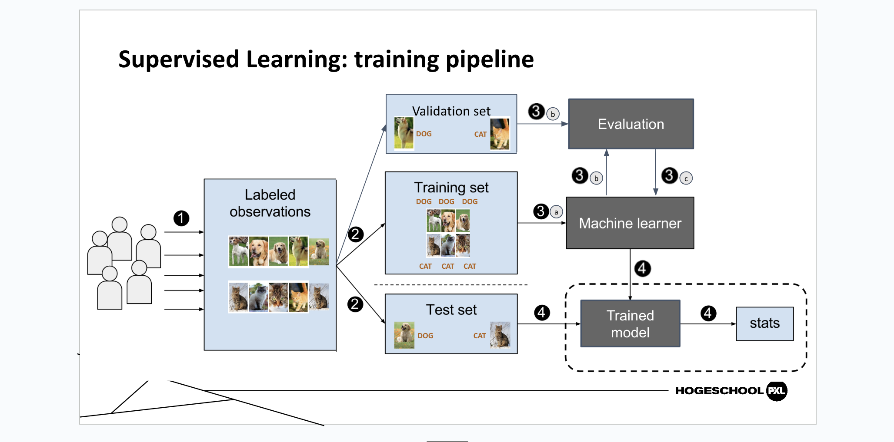
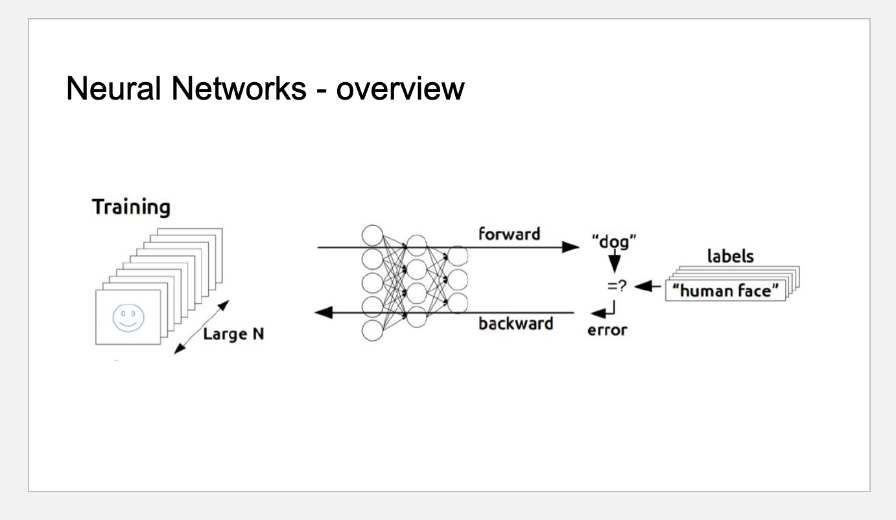
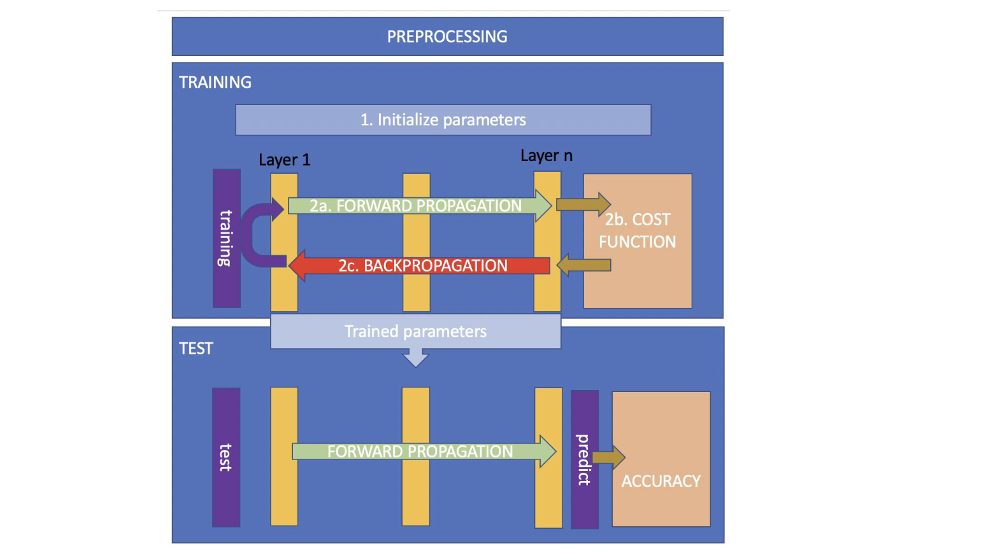
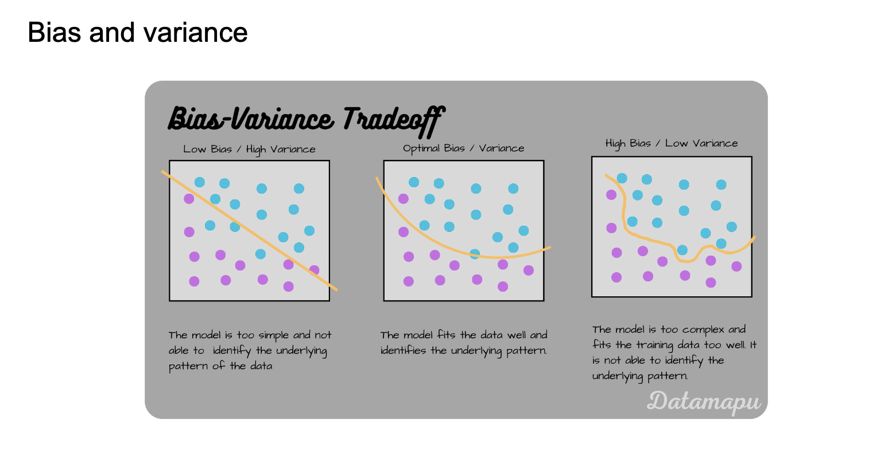
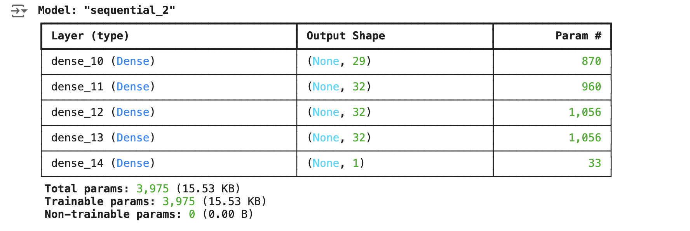
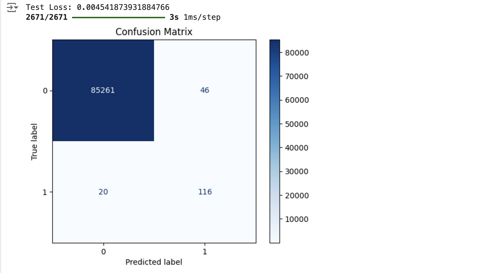

{width=935 height=527}

**Understand the building blocks, calculations, training process, input/output mechanisms, and theoretical concepts of neural networks,and challenges like bias-variance tradeoff and gradient importance.**

## Topic Overview

● Introduction

● Neural networks

   - Neurons
   
   - Loss functions

   - Gradient descent

   - Backpropagation

   - Optimizations

### Introduction - Machine Learning

“A subset of artificial intelligence in which a computer generates rules underlying or based on raw data that has been fed into it”

“Machine learning is a form of artificial intelligence (AI) that uses data to perform tasks without explicitly programming these tasks.”

“A computer program is said to learn from experience E with respect to some class of tasks T and performance measure P, if its performance at tasks in T, as measured by P, improves with experience E”

I learned that machine learning is categorised into three different types.

1. **Supervised Learning**

- Labeled Data
- Direct feedback
- Predict outcome
- Meaningful patterns in labeled data
- Most commonly used
- Most ready for real-world

2. **Unsupervised Learning**

- No Label
- No feedback
- Find hidden structure

3. **Reinforcement**

- Decision process
- Reward system
- Learn series of Action

{width=691 height=402}

From the image above the teacher explained the overview of how neural networks work in training and prediction. On the left, the training process starts with a large dataset of labeled images, such as "human face." These images are fed into a neural network, which is represented as a series of interconnected nodes (neurons). During the forward pass, the network processes the input data to predict an output, like identifying if the image is a "dog" or a "human face." The predicted output is compared to the actual label, and any errors are calculated. The backward pass uses this error to adjust the weights of the network through a process called backpropagation, improving the accuracy of future predictions.

## Processing in Neural Networks

The process of training a neural network, start from preprocessing and continuing to testing. In the training phase, the first step involves initialising parameters such as weights and biases. During forward propagation, input data flows through multiple layers of the network (from Layer 1 to Layer n), and the model predicts an output. This prediction is then compared with the actual result using a cost function, which calculates the error. 

Next, the process enters backpropagation, where the error is used to adjust the parameters (weights and biases) in the opposite direction of the gradient to minimize the error. This loop of forward propagation, cost function evaluation, and backpropagation continues until the parameters are optimized and the error is minimized. Once the parameters are trained, the model moves to the testing phase, where the trained parameters are used for forward propagation to predict outputs for new input data. The predicted results are then evaluated for accuracy, ensuring that the model performs well on unseen data.

{width=785 height=440}

### Bias and variance

This explains how well the model performs and its ability to generalize. Bias occurs when a model is too basic and fails to capture the inherent patterns in the data, resulting in underfitting. However, variance indicates how the model reacts to minor changes in the training data, potentially leading to overfitting with a highly intricate model. Finding the perfect equilibrium between bias and variance guarantees optimal performance of the neural network on both the training dataset and unfamiliar test dataset. 

{width=777 height=404}

## CLASS EXERCISE - Credit card Fraud

**Task**

**Build and train a model capable of detecting fraudulent transactions.**

**Process**

The process I took in building this neural network was importing essential libraries like TensorFlow, NumPy, and Pandas for model building, data manipulation, and analysis. The dataset, typically containing transaction records, is loaded, and the class distribution is analyzed to understand the imbalance between fraudulent and legitimate transactions. Data preprocessing involves scaling numerical features and encoding categorical data for better performance. The dataset is then split into training and testing subsets to evaluate the model's accuracy on unseen data. Since this is a binary classification task (fraud or no fraud), a binary cross-entropy loss function is used. A simple neural network is built with layers suited for classification, compiled with an optimizer like Adam, and trained on the processed data. Finally, the model is evaluated using metrics such as accuracy and precision to measure its ability to detect fraud effectively, as shown on some photos below and link above.

**Result**

[**Credit Card Model**](https://colab.research.google.com/drive/1rY_pKvSHScMoF5ZSWy17jdgTkmfAiYyn#scrollTo=v9vtzuEZ3X0f)

{width=888 height=299}

**Confusion metrix**

{width=898 height=497}

