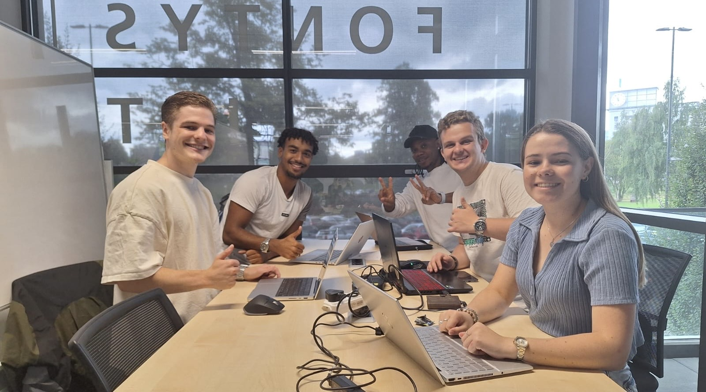
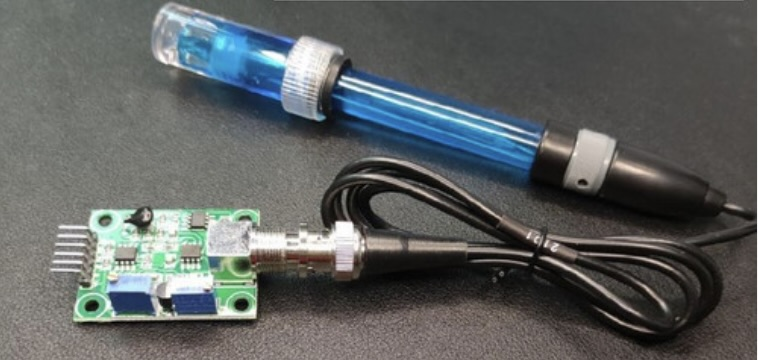

> **To resolve the issue of uncontrolled water hyacinth infestations that disrupt navigation, deplete oxygen levels, and damage the local ecosystem.**

# PROJECT ASSIGNMENT
This project is part of the Aquatic Weeds Programme (AWP) led by the Centre for Biological Control (CBC) at Rhodes University. The AWP research focuses on understanding invasion pathways, the ecology of emerging aquatic weeds, and developing bio-control strategies. A key concern is the invasive water hyacinth (Eichhornia crassipes), a South American species that has spread worldwide, clogging waterways, depleting oxygen in aquatic ecosystems, and creating breeding grounds for disease-carrying pests like mosquitoes.

The project objective is to predict the location and spread of water hyacinth mats using satellite imagery, weather data, and machine learning. This tool will provide local stakeholders, such as boaters and fishermen, with crucial information on mat movement, helping them navigate the dam safely and avoid the harmful effects of water hyacinth infestations. 

[**FIELD TRIP - EINDHOVEN**](https://git.fhict.nl/I503216/semester5portfolio/-/wikis/FIELD-TRIP-Eindhoven)

[FIELD TRIP SPAIN - Invasive plants](https://git.fhict.nl/I503216/semester5portfolio/-/wikis/INVASIVE-PLANTS-SPAIN)

# PROJECT GOAL

The current methods of predicting the spread and movement of these mats are insufficient, making it difficult for boaters, fishermen, and biocontrol teams to plan their activities and manage the invasive plant effectively. As a group our primary goal of the "Tracking Water Hyacinth Movement at Hartbeespoort Dam" project is to solve the problem of uncontrolled water hyacinth infestations in the dam, which disrupts navigation, depletes oxygen levels in the water, and damages the local ecosystem. 

The project addresses the need to predict the movement and distribution of water hyacinth mats using advanced technologies such as satellite imaging and machine learning algorithms. So, therefore we aim to remove and accurately forecast the location and movement of water hyacinth mats in Hartbeespoort Dam. This will enable stakeholders to proactively manage the water hyacinth problem, minimizing its environmental and economic impacts while ensuring safe navigation and effective biocontrol interventions. 

# MEET THE TEAM

**_Arthur Brouwers,_**  _**Andre Matias,**_ _**Carli Theron,**_ **_Tiaan Aubrey,_** **&** _**Izekor Kingsley**_

[**Project Info**](/uploads/05ebe36fb8b6df33c618397da5658963/Info.docx)

[**Project Plan**](/uploads/bb2c21cc7ffeb5e5888d96de42a05626/Projectplan_Nexus.docx)

[**Research Document**](/uploads/7eecddbdf1a540b73ef7a0261b8a238b/Research_Document.docx)

# VISION

Decades ago, water hyacinth (Eichhornia crassipes) spread from its native ecosystem in Amazonia, Brazil, and became an invasive species in water bodies across the globe. It also reached Africa and has ever since eaten into a number of lakes in South-Africa, such as the Hartbeespoort Dam in pretoria, Lake Tana Ethopia and Lake Victoria, Kisumu Kenya. 

Measures to remove the hyacinth all over the world have mostly been either through chemical treatments or manual removal. Either way, they have proven extremely ineffective and expensive. For instance, the municipal corporation in Ooty spent millions to clean the lakes in the tourist town, only to find it growing back. In Bengaluru indian, the Indian Army deployed 7,000 of its personnel to clean the Ulsooru lake, and their efforts had proved futile. In Africa, efforts to control the growth of water weeds were attempted by methods such as physical removal, chemical and biological control, but all of them have not been highly efficient. 

Therefore our vision as a team is to help Hartbeespoort Dam is located in the Northwest Province of South Africa, approximately 40 kilometers west of Pretoria, restore back water flow in the dam, sunlight penetration back into the water and increase oxygen levels, by using Remote sensing, and AI-enhanced digital twins help monitor and predict plant spread, ensuring timely intervention and efficient resource use. This will restore a thriving aquatic ecosystem. The clear, open waters will support abundant fish populations, rejuvenate local biodiversity, and create healthier habitats for wildlife. With the dam free of invasive species, it will become a sustainable resource for fishing, tourism, and recreation, benefiting both the environment and the surrounding communities. The project will serve as a model for effective ecological restoration, ensuring the long-term health and resilience of Hartbeespoort Dam.

# INNOVATIVE CONCEPT

The water hyacinth (Eichhornia crassipes) as a fast growing aquatic plant from South America, has spread to many parts of the world, including South Africa, where it is considered one of the most invasive species. Known for its vibrant purple flowers, this plant poses serious environmental and economic challenges, clogging waterways, reduces biodiversity, and disrupts ecosystems by outcompeting native plants. Julie Coetzee, the project stakeholder, a member of NRF – SAIAB, SARChl, Ecology and Management of aquatic invasive species and Central of Biological Control, Rhodes University South Africa informed us how ecology is being investigate and how this aquatic invasive species are being manage in South Africa. To help do this they built a biocontrol rearing facility as part of the SISONKE ('work together') program, where they provided employment opportunities for individuals with physical disabilities. They rear insects to increase the population of insects that feed on this invasive plants by releasing them at targeted locations. This process has helped to control and reduce the spread of water hyacinth plants but hasn't finally stop the increase and growth of the invasive plant. 

Therefore, my group and I conducted further research to investigate the reasons behind the significant increase in water hyacinth growth in Hartbeespoort Dam. Our main research question was **"_What strategies can we devise to mitigate the swift proliferation of the invasive species (water hyacinth) in Hartbeespoort Dam?_"** From this question, we brainstormed and generated sub questions which lead to our main three Concepts.

### Concept 1 - Solution to reduce pollution and invasive plant growth​

Our first concept was to introduce a filtration system that cleans incoming water, reducing nutrient levels, and ultimately limiting the aggressive growth of water hyacinth. This concept would help lessen phosphorus and nitrogen entering the water, reducing the resources that fuel water hyacinth growth, which will also improve the water quality. 

 

### Concept 2 - Human Powered-Bike

The system uses human-powered bikes to generate energy that powers a vacuum cleaner, which removes debris and invasive plants from the lake. Riders log into their accounts, tracking their energy contribution and lake cleaning progress, adding a competitive edge. This actually combines environmental cleanup with fitness, creating a sustainable, community-driven solution.

 

### Concept 3 - Data Like Images

There are already biological countermeasures in use to help fight the water hyacinth. This concept will use data like images of the dam, wind direction, wind speed and dam currents to determine where water hyacinth is on the dam and where it is going to move on the dam aiding in tracking and early detection of the plant. To replace the expensive satellite images this concept employs drones to get arial photos. The key benefit of this concept is that this data combined with machine learning algorithms will be used to detect and track the hyacinth.

 

# INTERACTIVE USER EXPERIENCE ( UX MODULE )

Generally, there are 4 Phases in User-centered Design. Each iteration of the UCD approach involves four distinct phases. First, as designers working in teams, we try to understand the context in which users may use a system. Then, we identify and specify the users’ requirements. A design phase follows, in which the design team develops solutions. The team then proceeds to an evaluation phase. Here, you assess the outcomes of the evaluation against the users’ context and requirements, to check how well a design is performing. More specifically, we need to see how close it is to a level that matches the users’ specific context and satisfies all of their relevant needs. From there, We make further iterations of these four phases, and we continue until the evaluation results are satisfactory.

To kick off our project and engage our users effectively, we created detailed personas, user profiles, and user scenarios. These will help us understand our users goals, behaviours, and challenges. Ensuring that our solutions are tailored to their specific needs and provide the best possible user experience.

- [**User Stories**](/uploads/aa5c41e3fd54601603785f03bb36f69f/User_stories.docx)
- [**Personas**](/uploads/0e9771f626113ee1419ee44eb3e47fb4/User_profiles__1_.docx)

### USER PROFILES

For this project we created 5 potential user profiles that suits out concept ideas, which is “ Employing drones to get arial photos of the dam, wind direction, wind speed. Detecting where water hyacinth is on the dam and where it is going to move on the dam aiding in tracking and early detection of the plant”.  The five user profiles we created were Farmer, Fisherman, Tourist, Boater and one for our main stake holder from The Center for Biological control in South Africa. 

 

 

## PROTOTYPE

Based on our concept idea which is to use data like images of the Hartbeesport dam, wind direction, wind speed and dam currents to determine where water hyacinth is on the dam and where it is going to move on the dam aiding in tracking and early detection of the plant. To replace the expensive satellite images this concept employs drones to get arial photos. We as a group (Nexus) therefore created various prototype, like paper prototype, Medium fidelity prototype and and high fidelity prototype representing how our final product will be for our target users. 

### Paper Prototype

As a team we brainstormed and concluded that starting with a paper prototype is very important because it allows quick and low cost idea generation. We knew that with just pen and paper, we could rapidly sketch out our concepts dashboard for our target users, also test different designs, and get immediate feedback without investing time in complex digital tools. So, at first I made a paper prototype to formerly show how our future end product would look like. On the Homepage of the sketch we have the basic layout of the header, the body and the footer. The header contained the navigation bar, the footer contain the our groups socials and information, while the body part contains basic layout of widgets. 

**_Home Page_** 

The home page have a basic sketch outlining our team’s vision for the first page of our user interface. As a media design student, I took the lead in designing the home page. I began by adding a header with five boxes for the navigation bar and included a written logo placeholder. In the body, I sketched five widgets, two circular and three rectangular. My team and I agreed on a minimalistic design, with a simple layout, that would make the home page easy to navigate and visually appealing.

[**ALL PAPER PROTOTYPE**](/uploads/5f86a715bfeac92417ecec26247ef367/PAPER_PROTOTYPE_HYACINTH.docx)

**_Including History, Prediction , and Drone page_**

The other pages we sketched are the History page, Prediction page, and the Drone page as shown in the PDF above. On the History page, we added widgets but initially weren't sure what content to include, so we decided to leave that for the medium fidelity phase when we would brainstorm further. For the Prediction page, we sketched out three widgets and button. On the Drone page, we added two rectangular boxes to help structure how we envisioned the drones recent captures.

## LOW FIDELITY PROTOTYPE - JUSTINMIND

The wireframe we made is a replica of the paper prototype but in digital form. Before we start making our various prototype, we were giving a lecture on “JustInMind”. A powerful design tool that enables designers to create interactive, high-fidelity prototypes for web and mobile applications. Its intuitive interface allows us to build detailed wireframes, simulate user flows, and test user interactions, providing a realistic preview of our final product. With this tool we replicated our paper prototype with same layouts, widgets and boxes as shown on the pdf below. 

[**ALL WIREFRAMES SKETCHES**](/uploads/1e5d0ed5eae6a9f93ade47b8d750eb9f/WireFrames_Hyacinth.docx)

## [MEDIUM FIDELITY PROTOTYPE](https://cloud.justinmind.com/usernote/prototype/63dedc7d12fe955e933c528645c10aa701ce5ae976e38db8a121d65729a01c65)

[**ALL MEDIUM PROTOTYPES**](/uploads/5b393903fe16d5c48bb6de1bc4ad178a/MediumFidelitypro.docx)

On this prototype, I started to implement more design on the wireframe templates. Although I wanted the medium fidelity prototype to look more advance. So I actually design all the pages from scratch. What I mainly did was to have the same layouts, structures, widgets and boxes. This time around, I added colours, written words, structured the navigation bar with links to different pages, added socials to the home page and some photos.

## [FINAL PROTOTYPE](https://cloud.justinmind.com/usernote/prototype/faf5179191f2a2e08ed0e3daa4d1c55b5f879f21cf7a2ffc7022360e21a673eb)

After progressing through the low and medium fidelity prototypes, we designed the final version of our prototype which represents a fully functional and interactive design by improving what we had from earlier stages, and incorporating all feedback from teachers, inter-group evaluation and usability testing from targeted users. As a group we started designing the final prototype by brainstorming what we would like to have on each page of the final product and how to implement it. The first step we took was deciding to upgrade our medium fidelity by incorporating all the necessary functionalities on each page, what will be on each widgets  and the necessary informations on the widgets. As you can see below, the image on the left was the medium fidelity containing just  the basic layouts, header, footer, widgets and a few written words. On the High fidelity prototype shown in the image on the right, I started with the navigation bar on the header by increasing the size of the logo, and placing colours around each words on the navaigation bar to highlight the current page the user is viewing. We embedded sub-widgets within the main widgets to show what content will appear on each page when a widget is clicked. In addition, I added links to the widgets, serving as shortcuts for users to easily navigate from individual widgets to the main page that contains all the related content.

My teammates focused on worked the history and prediction pages. On the history page, they included past predictions, while the prediction page showcased future forecasts, both illustrating the movement of water hyacinth. These pages presumed to use real time data and images captured by drones flying over Hartbeespoort Dam to provide accurate insights into the past and future spread of the hyacinth. Images representing the two pages are shown below.  

I also created the final page which is the drone page. Containing the amount of drones that will flying over the hartbeespoort dam, revealing the spread of water hyacinth, and the percentage coverage on the water surface. On the same page the user can also see the active drones and the recent picture they took, and also the non active drones with error message like there is an issue possibly due to a server issue, connectivity problem, or data corruption, Or a technical failure because a drone encountered an issue and became stuck, either during flight or while capturing images. 

To summarise the whole process and what I've learnt from creating this high fidelity prototype. I understood that the final prototype maintains the core structure established in the earlier stages, with a refined layout and polished visual elements like buttons with names on the widgets, our logo, links from one page to another, pictures and update of the current situation on Hartbeespoort Dam, picture from drones showing the curent state of the dam and the amount of water hyacinth coverage and also buttons to switch language for our potential users. Bellow is the link to final prototype created with "**Justinmind**". 

[High fidelity prototype](https://cloud.justinmind.com/usernote/prototype/faf5179191f2a2e08ed0e3daa4d1c55b5f879f21cf7a2ffc7022360e21a673eb)

## USABILITY EVALUATION

### Expert Evaluation

After finalising and designing our final prototype we conducted two specific types of Expert Evaluations. The first was with the teachers of this module, and the second one was with other groups from our class. 

**Teachers Evaluation** 

The teacher's evaluation was a mandatory part of the module, to guide and assess whether we had successfully implemented and iterated the feedback we received throughout the design process, from the low-fidelity prototype to the final version, and also to ensure it was functioning properly and had a user-friendly interface. Before beginning the user evaluations with the teachers, it was mandatory in this module to provide a Consent & Recording Release Form for them to sign. The consent form was for the user to agree to participate in the task conducted and recorded for us. 

_Feedback from Rosa_: When you make a graph it is important to show what you are measuring. On the Drone page, I interpreted that the page is okay, there is a sign of critical error on one of the drones. Sometimes when you design, there should not be a lot of space, and also try to improve your space. 

_Feedback from Toni_: First question "Why are you recording me?". You should not explain to your user where to go on your web application. Now i can navigate easily and i understand it better. It will be better if you can reformulate the Task. 

After navigating through our prototype, we provided the teachers with a digital questionnaire to complete. The purpose of this questionnaire was to gather their feedback and rate their satisfaction with the usability and overall experience of our prototype.

**Inter-Group Evaluation**

The teachers randomly assigned groups to evaluate each other's prototypes and provide feedback. Our group was tasked with evaluating the prototype created by the Hunters, while our prototype was to be evaluated by the Reclaimers.

The Reclaimers: Some useful feedbacks and recommedation given to us by the reclaimers following the 10 Rules of Thumb Design Guildlines

1. Add visual indicators (e.g., highlighted tabs, progress bars) to show the
current page and active processes.
2. Use more intuitive labels and map representations in the predictions
and history sections.
3.Add "back" and "cancel" buttons for easier navigation and undoing
actions.
4. Add keyboard shortcuts or customisations for expert users to navigate
faster.
5. Excessive white space on certain pages, reducing overall functionality.
6. Add a help section with documentation, tooltips, and tutorial guides.

These feedback from the reclaimers helped shape our final prototype to the latest version we have right now. After receiving the feedback from the reclaimer, we decided to implemented the most useful ones before embarking on the evaluation with some target users. 

## EVALUATION WITH USERS 

The primary goal of testing the prototype with users was to evaluate the usability and effectiveness of the user interface. The tests were conducted using  Justinmind, a prototyping tool that allows for creating and simulating interactive prototypes, enabling precise data collection on user interactions and usability. 

During the usability test, 15 participants, who matched the target demographic, were invited to perform a series of representative tasks on the prototype. Each participant was greeted by us as a group, asked to sign a consent form, and given instructions on how to interact with the prototype using Justinmind. They were informed that they could withdraw at any time during the test. None of the participants had prior experience testing the website application. Throughout the test, we refrained from assisting the participants, even when they encountered a little challenge with the Justinmind setup. 

### Results 

**The following data was collected for each participant**:  

-  Number of tasks completed without assistance  
-  Time to complete all tasks  
-  Number and types of errors  
-  Participants recommendations 
-  Participant’s satisfaction about the system. 

After doing the tasks, participants were asked to do the post – test questionnaire. It was created with the System Usability Scale. The average of points was: 70.71. 

**Major Findings**: 

- Users found the system very easy to use. 
- There were a few problems related to using the prototype in a web browser. 
- The users wanted us to show what we are measuring on the graphs 
- Some system functions were not as intuitive as they could be. This might be due to users' lack of familiarity with the application, although all participants stated they could use the system easily after a few minutes of learning. 
- The overall score of the application on the SUS scale was 70.71, which is classified as "good." 

**Areas of improvement** : 

- Minimize the amount of blank or unused space in the prototype pages. 
- Add an optional tutorial to guide users on how to navigate and use the application. 
- Enhance the drone error button to be more interactive and responsive, displaying a popup error message when clicked or hover	

## METRIC BOARD REPORTS

## COMMON INDUSTRY FORMAT ( CIF DOCUMENT ) 

This document is primarily for reporting results of formal usability tests in which quantitative measurements were collected and is particularly appropriate for summative/comparative testing. " The CIF does not actually tell you
what to do, it rather tells you how to report on what you did" . 

The CIF contains four sections which are detailed on the document I will attached below

1. Executive Summary 
2. Introduction
3. Methods
4. Results

[Group Nexus **CIF**](/uploads/b4651e9c84f882c71a691f2e9a334716/CIF.docx)

[Updated **CIF**](/uploads/298504071674614b8cc50c29d2a65d8c/CIF.docx)

# INTERNET OF THINGS (IOT)

The IoT module of this project explores a diverse range of topics, focusing on the application of IoT technologies to address real-world challenges such as the management of invasive species. Key components of the course include in-depth study and practical implementation of ESP32 microcontroller, which serve as the backbone for connecting and controlling various sensors used in environmental monitoring. We worked and gained hands-on experience with different types of sensors, such as
temperature, humidity, Ph and motion sensors, essential for detecting and analysing environmental data. We also covered communication protocols, such as TTN and MQTT, which facilitate efficient and reliable data transmission between devices. exploring integration with the Android IDE to develop mobile applications that enable remote monitoring and control of IoT systems. Additionally we delved into the use of LoRaWAN technology for long-range, low-power communication, critical for deploying IoT solutions in remote or expansive areas.

## Project IOT devices and Research

### **ESP32**

ESP32 microcontroller serves as the backbone for connecting and controlling various sensors used in environmental monitoring in this project. It is a powerful, low-cost, low-power system chip designed for IoT applications, embedded systems, and wireless communication. It also supports a variety of tasks, from sensor data processing to real-time wireless communication, making it ideal for projects requiring connectivity, efficiency, and performance.

[ESP32 Research Document](/uploads/e15f0d1429f27e75e3ee8c8c57cd0855/ESP32_Microcontroller_Research.docx)

### **Arduino Lora Network**

This Arduino Lora device uses LoRa (Long Range) technology with Arduino-compatible devices to create low-power, long-range wireless networks for IoT applications. LoRa the wireless technology is made for communicating over long distances, providing energy efficient, low power connectivity across distances up to 15 kilometers in rural areas and several kilometers in urban environments. It is also also ideal for remote sensing and monitoring. 

[Lora Arduino Research](/uploads/70e98deec08969be04ff3e1eb4d9a88d/Arduino_LoRa_Network_Research.docx)

{width=278 height=167}

### **DS18B20 Temperature Sensor**

Before connecting the DS18B20 Temperature Sensor, we did research about the sensor. On the research we found out that the sensor is well used in IOT because of it’s accurate, easy to use, and can measure temperatures from -55°C to 125°C. We also learnt that it doesn’t need complex circuits to work because it sends temperature data digitally by connecting to microcontrollers like Arduino or ESP32. More details from the research about the DS18B20 Temperature Sensor is on the research document below

[Temperature Sensor Research](/uploads/68ee0ba228d93e3636800366863ff98a/Research.docx)

### TDS (Total Dissolved Solids) Meter Sensor

From the research we found the usefulness of the sensor which is used to measure the concentration of dissolved solids in a liquid, typically water. Dissolved solids like any salts, minerals, or metals dissolved in water, which contribute to its conductivity. We also learnt that TDS sensor meters are commonly utilised in water quality analysis to evaluate the cleanliness of water and detect impurities. Elevated TDS levels may signal the existence of undesirable impurities, which could affect the flavour, mineral content, or drinkability of water.

[Meter Sensor Research DOCUMENT](/uploads/a0a5741977b09d51a568a45a32a7ca5e/Research_TDS_Meter-Sensor.docx)

### PH Sensor

[PH_sensor Research](/uploads/7384f6ff71b77eafdc52ed9e27564c7c/PH_sensor_Research.docx)

Based on research the PH-4502C sensor is an analog pH sensor module designed to measure the acidity or alkalinity of a solution. It is widely used in applications like water quality monitoring, hydroponics, and aquariums, it also provides accurate pH readings by converting the solution's pH level into an electrical signal. The PH-4502C works easily and compatible with microcontrollers like Arduino or ESP32, making it ideal for environmental monitoring and automated systems requiring real-time pH measurement.

### LoRa (Long Range) and LoRaWAN (Long Range Wide Area Network)

LoRa is a wireless technology made for communicating over long distances, providing energy efficient, low power connectivity across distances up to 15 kilometers in rural areas and several kilometers in urban environments. While LoRaWAN is the communication protocol and system structure designed for LoRa, enabling it to support large-scale IoT deployments by efficiently managing data from thousands of devices. He went for to inform us that together, LoRa and LoRaWAN are ideal for applications where low power consumption and long battery life are critical, such as using sensors for environmental monitoring like the Haartbeesport Dam in South Africa, smart agriculture, asset tracking, and smart city infrastructure. These networks allow devices to transmit small amounts of data over extended distances without requiring high power, making them a cornerstone in developing scalable IoT solutions.

### The Things Network (TTN)

The Things Network was designed to provide LoRaWAN connectivity for IoT devices.

One of our main project objective from the stakeholders from Central for biological Control was to detect the water hyacinth itself or macrophytes on water and detecting the floating species and also tracking its motion.  To detect and track these invasive species requires sensors, and The Things Network connects with LoRaWAN to enable sensors and devices to communicate with cloud-based applications efficiently which will help us details the movement of these Invasive plants and macrophytes. 

To make this work The Things Network utilizes the LoRaWAN protocol to create a link between IoT sensors, devices, and cloud-based applications, enabling efficient, low-power, long range communication as shown picture below in some areas in AUSTRIA

## CONNECTING THE DEVICES 

### LoRaWAN Application, The Things Network (TTN) and GPS Connection

In this project, we connected LoRaWAN, The Things Network (TTN), and GPS to create a live IoT data system. First, we registered an application on TTN to represent our hardware device, enabling us to display live data from the LoRaWAN connection. After setting up the LoRaWAN module on a breadboard with an ESP32 microcontroller, we registered our device, named "Nexus Lowra," on TTN and configured it with a C++ code from GitHub. This code allowed us to view data from the device in TTN’s Application Overview and Live Data sections. TTN’s features, such as Payload Formatters, Integrations, Collaborator Management, and API Keys, were essential for decoding data, connecting with external applications, enabling team collaboration, and securing device access.

We then integrated a GPS module into the setup to collect location data and transmit it via the LoRaWAN network. Despite initial challenges, we connected the GPS to the LoRaWAN device, placed it near a window for better signal reception, and verified its operation by checking for a flashing light on the LoRaWAN module. The program then collected GPS coordinates (latitude, longitude, altitude, speed) and encoded them into a payload compatible with LoRaWAN. This payload was sent over the network to the TTN gateway, where the data appeared in real-time on the Live Data page as shown below. 

### Connecting pH, Temperature, and TDS Sensor to Device

We began by setting up the DS18B20 temperature sensor, known for its accuracy and simplicity in IoT applications, by connecting it to our ESP32 on a breadboard along with other components. After cloning the necessary code from our teacher's GitHub repository, we adjusted it to include our TTN credentials and payload formatters, enabling the temperature data to display on TTN's live data page after several troubleshooting attempts. Then the next task involved connecting the PH-4502C pH sensor. Guided by instructions given to us by the teacher on Discord , we connected its VCC, GND, and analog output pins to the ESP32’s respective 3.3V, GND, and GPIO 36 pins. After seeing a green light indicating successful setup, we used a code provided on GitHub to view pH readings in Visual Studio Code’s terminal output, then transmitted this data to TTN for real-time display. 

Lastly, we integrated the TDS sensor to measure dissolved solids in water, which can indicate impurities. This sensor was connected similarly, with VCC to 3.3V, GND to GND, and the analog output (A0) to GPIO 34 on the ESP32. Using the teacher’s code, we configured the ESP32 to read and transmit TDS values. With the App ID and API Key added to the code, TTN’s payload formatters processed and displayed the live TDS data on the TTN dashboard. Each sensor device was successfully connected to the ESP32 microcontroller and configured with code to gather and send readings through TTN, allowing for live monitoring and data management on the TTN platform as also shown bellow.

### DASHBOARD AND LIVE-DATA

After completing the device setup by connecting all the sensors, I collaborated with my group members to confirm that it was functioning correctly and transmitting data to The Things Network (TTN). I verified that key data like temperature, latitude, altitude, and pH levels were visible on The thing Network (TTN), ensuring that the setup was transmitting as expected. With the data confirmed, I proceeded to modify the provided Node.js and HTML code from my team members (Arthur and Andre). My task was to pull data from both TTN via MQTT and display it on our dashboard interface. First, in Node.js, I developed functions to retrieve data by querying the database for stored values and subscribing to MQTT for real-time updates from The Things network(TTN). I organized the data in JSON format, preparing it for display on the dashboard.

Next, I edited the HTML file, adding elements where the data would appear and using JavaScript to dynamically update these elements with data from Node.js. Finally, I ran the Node.js file in the terminal, and the data displayed in real-time on the user interface, successfully creating a live dashboard to monitor environmental parameters as shown below. 

On the data dashboard, you can see live data and the current location of our device displayed on the map. Below the map, various parameters, values, and timestamps are shown, providing real-time information.

The map on the dashboard is interactive. On the map you can see the topographic view, which represent the area where data is being collected here in Hagenberg. The blue location pin on the map indicates the exact spot where the IoT device is located. This marker provides a quick visual reference to the location of the data source.  Below the map, there is a data table with three columns, "Parameter," "Value," and "Timestamp." The table lists various parameters monitored by our IoT device, along with their current values and the timestamp for each data point. Under the parameters we have 

- **Device ID**: "Nexus-Lowa," which is our unique name for the IoT device.

- **Latitude and Longitude**: Which displays the geographical coordinates (48.3676897281538, 14.5125124865241) of our device’s location.
- **Altitude**: Which shows "270," in meters at that time, indicating the elevation of the device.
- **Temperature**: Which was currently showing "N/A,"  meaning that temperature data was unavailable because it takes more time to load.
- **pH**: shows measurement of the water’s pH level, that came with the pH. But its showing "N/A,"  meaning that pH data was unavailable because it takes more time to load. 
- **TDS**: Which was also currently showing "N/A," at the time I took the photo because our device was unplugged

# AI MODULE