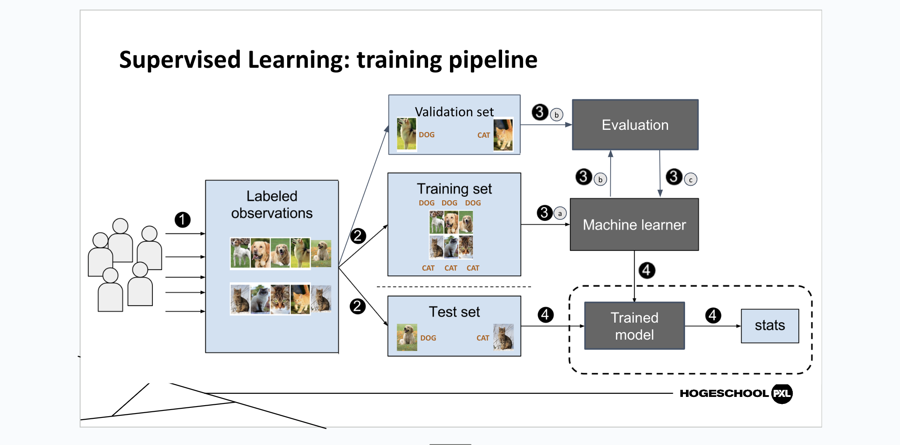

## Machine Learning

“A subset of artificial intelligence in which a computer generates rules underlying or based on raw data that has been fed into it”

“Machine learning is a form of artificial intelligence (AI) that uses data to perform tasks without explicitly programming these tasks.”

“A computer program is said to learn from experience E with respect to some class of tasks T and performance measure P, if its performance at tasks in T, as measured by P, improves with experience E”

From this lecture, I learned that machine learning is categorised into three different types.

1. **Supervised Learning**

- Labeled Data
- Direct feedback
- Predict outcome
- Meaningful patterns in labeled data
- Most commonly used
- Most ready for real-world

2. **Unsupervised Learning**

- No Label
- No feedback
- Find hidden structure

3. **Reinforcement**

- Decision process
- Reward system
- Learn series of Action

**Inference**

The process of using a trained machine learning model to make predictions or decisions based on new, unseen data.

### Classification vs. Regression

Classification is a type of supervised learning that aims to forecast a distinct label or category for a provided input. For instance, figuring out if an email is "spam" or "not spam" or recognising the type of flower by its characteristics.

Regression is an activity in supervised learning that involves making predictions of a continuous numerical value using input features. For instance, forecasting the cost of houses by considering factors such as dimensions, position, and quantity of rooms

### Structured vs. unstructured data

Data that is structured is well organized and arranged in columns and rows, usually found in relational databases. While, data that is unstructured does not have a specific format and cannot be easily organized into rows and columns. It consists of various data formats like text, pictures, sound, and videos.

# CLASS EXERCISE

**Using your newly acquired knowledge in machine learning, create a dataset with various photos and identify the corresponding output elements.**

**Process**

I followed the teacher's recommendation and searched for a website called Teachable Machine on Google, where I registered. I then downloaded numerous photos of horses and tigers from Pexels and uploaded them to Teachable Machine to train my data. After the training process, I tested the model by uploading a photo of a zebra to see if it would recognise it. I expected the result to be closer to a horse since zebras and horses belong to the same animal family. However, the model identified the zebra as 90% tiger, likely due to the visual similarity of their stripes.

