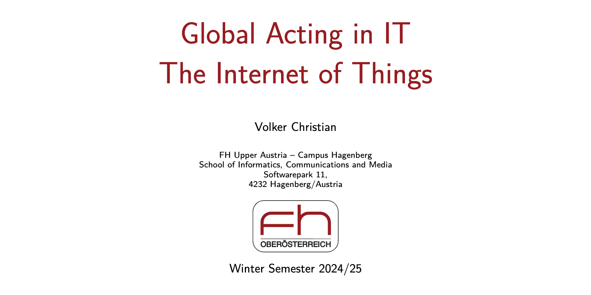

# DS18B20 Temperature Sensor Interfacing with ESP32

Today Monday 28th September, we had our first lecture of the week. On this lecture the topic was **DS18B20 Sensor Interfacing with ESP32**. The purpose of this lecture was to learn how to connect a temperature sensor to our Things Network to receive live Data of the temperature and display it on our Things Network interface. To start the day the teacher gave us a link to is GitHub Repository and asked us to clone, Synchronise our Fork in gitHub and Pull it. This means to create a copy of the original repository in our own GitHub account. Over time, when the main repository may receive updates like new commits, bug fixes, or features that the new clone or fork doesn’t have. After cloning the repository, we were told as a group to pull the updates to our local machine if we have a local copy of the forked repository. 

Before connecting the DS18B20 Temperature Sensor, we did research about the sensor. On the research we found out that the sensor is well used in IOT because of it’s accurate, easy to use, and can measure temperatures from -55°C to 125°C. We also learnt that it doesn’t need complex circuits to work because it sends temperature data digitally by connecting to microcontrollers like Arduino or ESP32. More details from the research about the DS18B20 Temperature Sensor is on the research document below

[Research.docx](/uploads/68ee0ba228d93e3636800366863ff98a/Research.docx)

After doing that, we connected the temperature sensor to our breadboard containing  our ESP32 Microcontroller, jumper wires, 2.7kv resistors, LEDs, GPS and our LoRaWAN as shown below. 

We then copied the code from our teacher's GitHub repository. A team member inserted the code on their Windows computer and ran it in Visual Studio Code. Together, we modified the code by adding our API key and API ID from The Things Network, and we also adjusted parts of the code to integrate it with the custom payload formatters we had already created. After connecting the code and hardware device to The Things Network, it initially didn’t work. We made multiple attempts, and after many tries, we finally received the temperature readings, which displayed successfully in the live data section on The Things Network, as shown below.

# PH-meter connection using PH-4502C

### TASK

**Connect the PH sensor and implement the temperature data into The things network (TTN)**

On the second lecture of the week the teacher guided us through the same hands on project involving monitoring environment and detecting movement of things. On this lecture the teacher gave us a class work to connect a pH sensor to an ESP32 microcontroller, instructing us to measure and log pH levels from a water sample that came with the PH 4502C.  In addition to this, the teacher challenged us to integrate temperature data as well, just to enhance the dataset to provide a more comprehensive environmental profile.

Since the project budget is allocated for the group rather than each individual, one person in the group is designated to work with the pH sensor and other sensors, while the remaining members support by conducting research, managing tools, and providing other assistance to achieve accurate results. The team leader began connecting the pH sensor to the breadboard in the same way we connected previous sensors. By following a guide shared by our teacher on Discord, which explained how to identify each pin on the PH-4502C board and showed where to connect them on the ESP32 microcontroller using jumper wires. Before the group leader began the connection, other group members had attempted to connect the pH sensor the day before, while the leader was occupied with handling the temperature data. To begin today’s task, we connected the VCC pin of the PH-4502C sensor to the 3.3V pin on the ESP32, connected the GND pin on the sensor to a GND pin on the ESP32, and finally, connected the Analog Output pin of the PH-4502C sensor to the GPIO 36 analog input pin on the ESP32. After completing the connections, we saw a green light indicating the setup was successful.

We copied the code provided by our teacher on his GitHub repository into our fork of the repository and make a copy in our own GitHub account. After forking, we cloned our forked repository to our local machine, allowing us to work with the code directly. Next, we opened the cloned repository in Visual Studio Code, we had all the files and code readily available for editing and testing. We then ran the code terminal, which allowed us to see the results directly in the terminal output.

**PH-4502C sensor Code from Git**

[Reference link](https://github.com/nthnn/PH4502C-Sensor)

# TDS (Total Dissolved Solids) Meter Sensor

Our next task of the day was also to connect Total Dissolved Solids meter sensor. First as a group we did a research about the sensor. From the research we found the usefulness of the sensor which is used to measure the concentration of dissolved solids in a liquid, typically water. Dissolved solids like any salts, minerals, or metals dissolved in water, which contribute to its conductivity. We also learnt that TDS sensor meters are commonly utilised in water quality analysis to evaluate the cleanliness of water and detect impurities. Elevated TDS levels may signal the existence of undesirable impurities, which could affect the flavour, mineral content, or drinkability of water.

[RESEARCH DOCUMENT](/uploads/a0a5741977b09d51a568a45a32a7ca5e/Research_TDS_Meter-Sensor.docx)

**Task**

**Connect TDS meter sensor to the ESP32 and display live data on The Things Network**

According to the teacher, this was more of a direct connection that the other sensors. Just like the same way we connected every other sensors, we connected the VCC from the TDS to the 3.3V on the EPS32 ESP32, GND to any GND pin on the ESP32, and the A0 pin to one of the analog input pins on the ESP32, like GPIO 34. We then use the code from the gitHub of the teacher to connect the ESP32 to read the analog signal from the sensor. 

On The Things Network , we connected the ESP32 to the internet, with our App ID (Nexus lowra) and API Key from The things Network. We added these details to our code so that the ESP32 can send the data to The Things Network. On the payload formatters we wrote code that reads data from the TDS sensor every few seconds and sends it to TTN. Then we saw the live updates of TDS values on our TTN dashboard, where the data is displayed and stored. 

# REVISION CLASS

In the third and final lecture of the week, the teacher asked us to ensure that all our sensor connections GPS, temperature, pH sensor, and meter sensor were functioning correctly. We also needed to check for any errors, troubleshoot mistakes, and verify that live data from each sensor appeared in The Things Network. Our team carefully reviewed each connection, with the team leader double checking that everything was properly linked. Occasionally, we experienced connection drops, which we promptly fixed to maintain a stable setup.